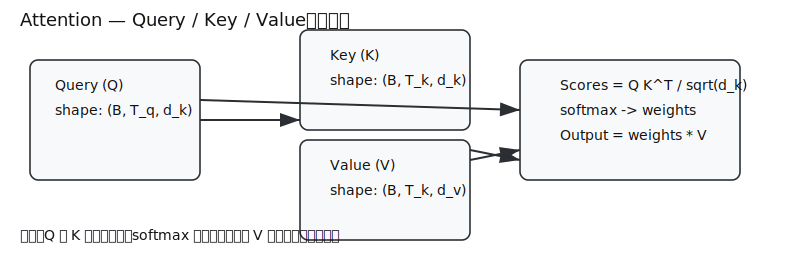
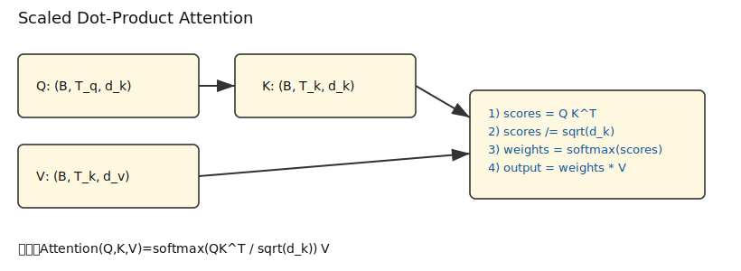
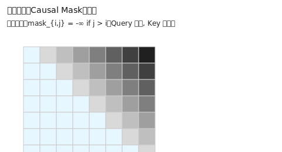
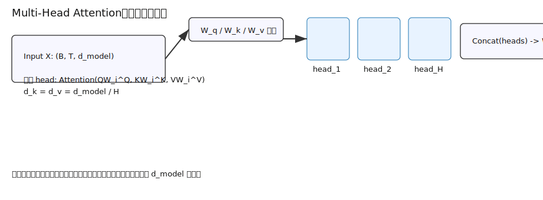

# 注意力机制（Attention Mechanism）

## 1. 核心概念：Attention是什么？

### 1.1 直观理解
想象一下阅读时的场景：当你看一句话时，不会平均分配注意力到每个词上，而是会**重点关注**与当前理解最相关的词语。

例如，读"这只猫跳上了桌子，然后它开始睡觉"时：
- 理解"跳"时，你会关注"猫"
- 理解"它"时，你会回看"猫"和"桌子"，但最终确定"它"指代"猫"

**注意力机制就是让模型学会这种"有选择地关注"的技术。**



### 1.2 核心三要素：Query, Key, Value
用图书馆查资料的类比来理解：
- **Query（查询）**：你的信息需求，比如"我想找关于深度学习的书籍"
- **Key（键）**：书籍的标签/索引，比如书名、主题分类
- **Value（值）**：书籍的实际内容

注意力机制的工作流程：
1. 用Query与所有Key计算**相似度**（相关性分数）
2. 将相似度转换为**权重**（注意力权重）
3. 用权重对Value进行**加权求和**，得到最终结果

## 2. 缩放点积注意力（Scaled Dot-Product Attention）

### 2.1 数学定义
给定：
- 查询矩阵 \( Q \in \mathbb{R}^{B \times T_q \times d_k} \)
- 键矩阵 \( K \in \mathbb{R}^{B \times T_k \times d_k} \)
- 值矩阵 \( V \in \mathbb{R}^{B \times T_k \times d_v} \)

其中：
- \( B \)：batch size（批大小）
- \( T_q \)：查询序列长度
- \( T_k \)：键序列长度（通常 \( T_k = T_q \)）
- \( d_k \)：查询和键的维度
- \( d_v \)：值的维度

缩放点积注意力的计算公式：

\[
\text{Attention}(Q, K, V) = \text{softmax}\left(\frac{QK^{\top}}{\sqrt{d_k}}\right) V
\]

### 2.2 逐步计算过程

#### 步骤1：计算相似度矩阵
\[
S = \frac{QK^{\top}}{\sqrt{d_k}} \quad \text{其中 } S \in \mathbb{R}^{B \times T_q \times T_k}
\]

这里的 \( QK^{\top} \) 计算了每个查询与所有键的点积相似度。除以 \( \sqrt{d_k} \) 是为了防止点积值过大导致softmax梯度消失。

#### 步骤2：计算注意力权重
\[
A = \text{softmax}(S) \quad \text{其中 } A \in \mathbb{R}^{B \times T_q \times T_k}
\]

对每一行（每个查询对应的所有键）进行softmax，得到归一化的注意力权重。

#### 步骤3：加权求和


\[
\text{Output} = A \cdot V \quad \text{其中 Output} \in \mathbb{R}^{B \times T_q \times d_v}
\]

## 3. 因果注意力（Causal Attention）

### 3.1 为什么需要因果注意力？
在文本生成任务中，模型在预测第 \( i \) 个词时，**不应该看到**第 \( i \) 个词之后的信息。这就像人类写句子时，只能基于已经写出的内容来续写。

### 3.2 掩码实现
通过注意力掩码 \( M \) 来实现因果限制：

\[
M_{i,j} = \begin{cases} 
0 & \text{if } j \leq i \quad \text{(允许访问)} \\
-\infty & \text{if } j > i \quad \text{(禁止访问)}
\end{cases}
\]

计算过程：
\[
S = \frac{QK^{\top}}{\sqrt{d_k}} + M
\]
\[
A = \text{softmax}(S)
\]

**实现技巧**：通常使用下三角矩阵，上三角部分设为负无穷（-inf）。



## 4. 多头注意力（Multi-Head Attention）

### 4.1 动机：为什么需要多头？
单一注意力机制可能不够灵活。多头注意力让模型能够：
- **同时关注不同方面的信息**
- 例如：一个头关注语法结构，一个头关注指代关系，一个头关注语义关联

### 4.2 数学定义
将输入投影到 \( H \) 个不同的子空间，每个头独立计算注意力：

\[
\text{head}_i = \text{Attention}(QW_i^Q, KW_i^K, VW_i^V)
\]
\[
\text{MultiHead}(Q, K, V) = \text{Concat}(\text{head}_1, \ldots, \text{head}_H)W^O
\]

其中：
- \( W_i^Q \in \mathbb{R}^{d_{\text{model}} \times d_k} \)
- \( W_i^K \in \mathbb{R}^{d_{\text{model}} \times d_k} \)
- \( W_i^V \in \mathbb{R}^{d_{\text{model}} \times d_v} \)
- \( W^O \in \mathbb{R}^{H \cdot d_v \times d_{\text{model}}} \)

通常设置 \( d_k = d_v = d_{\text{model}} / H \)。



## 5. 代码实现详解

### 5.1 基础注意力实现
```python
import torch
import torch.nn as nn
import torch.nn.functional as F
import math

def scaled_dot_product_attention(Q, K, V, mask=None):
    """
    缩放点积注意力实现
    
    Args:
        Q: 查询张量, shape (B, T_q, d_k)
        K: 键张量, shape (B, T_k, d_k)  
        V: 值张量, shape (B, T_k, d_v)
        mask: 注意力掩码, shape (B, T_q, T_k)
    
    Returns:
        输出张量和注意力权重
    """
    # 计算相似度得分
    scores = torch.matmul(Q, K.transpose(-2, -1))  # (B, T_q, T_k)
    
    # 缩放
    d_k = Q.size(-1)
    scores = scores / math.sqrt(d_k)
    
    # 应用掩码（如果提供）
    if mask is not None:
        scores = scores.masked_fill(mask == 0, -1e9)
    
    # 计算注意力权重
    attention_weights = F.softmax(scores, dim=-1)  # (B, T_q, T_k)
    
    # 应用注意力权重到值上
    output = torch.matmul(attention_weights, V)  # (B, T_q, d_v)
    
    return output, attention_weights
```

### 5.2 多头注意力完整实现
```python
class MultiHeadAttention(nn.Module):
    def __init__(self, d_model, num_heads):
        super(MultiHeadAttention, self).__init__()
        assert d_model % num_heads == 0
        
        self.d_model = d_model
        self.num_heads = num_heads
        self.d_k = d_model // num_heads
        
        # 线性投影层
        self.W_q = nn.Linear(d_model, d_model)  # 查询投影
        self.W_k = nn.Linear(d_model, d_model)  # 键投影  
        self.W_v = nn.Linear(d_model, d_model)  # 值投影
        self.W_o = nn.Linear(d_model, d_model)  # 输出投影
        
    def forward(self, Q, K, V, mask=None):
        batch_size, seq_len = Q.size(0), Q.size(1)
        
        # 线性投影
        Q = self.W_q(Q)  # (B, T, d_model)
        K = self.W_k(K)  # (B, T, d_model)
        V = self.W_v(V)  # (B, T, d_model)
        
        # 重塑为多头格式: (B, T, num_heads, d_k) -> (B, num_heads, T, d_k)
        Q = Q.view(batch_size, -1, self.num_heads, self.d_k).transpose(1, 2)
        K = K.view(batch_size, -1, self.num_heads, self.d_k).transpose(1, 2)
        V = V.view(batch_size, -1, self.num_heads, self.d_k).transpose(1, 2)
        
        # 计算缩放点积注意力
        scores = torch.matmul(Q, K.transpose(-2, -1)) / math.sqrt(self.d_k)
        
        # 应用掩码
        if mask is not None:
            scores = scores.masked_fill(mask == 0, -1e9)
        
        # 计算注意力权重
        attention_weights = F.softmax(scores, dim=-1)
        
        # 应用注意力到值上
        context = torch.matmul(attention_weights, V)  # (B, num_heads, T, d_k)
        
        # 合并多头: (B, num_heads, T, d_k) -> (B, T, d_model)
        context = context.transpose(1, 2).contiguous().view(
            batch_size, -1, self.d_model
        )
        
        # 输出投影
        output = self.W_o(context)
        
        return output, attention_weights
```

### 5.3 高效实现技巧
实际项目中常用的一次性QKV投影：
```python
def efficient_multi_head_attention(x, mask=None):
    """
    高效的多头注意力实现：一次性投影QKV
    """
    B, T, C = x.shape  # batch_size, seq_len, channels
    
    # 一次性投影QKV (更高效)
    qkv = self.qkv_projection(x)  # (B, T, 3 * d_model)
    Q, K, V = qkv.chunk(3, dim=-1)  # 各为(B, T, d_model)
    
    # 后续处理与上面相同...
    # 重塑、计算注意力、合并等
```

## 6. 复杂度分析与工程优化

### 6.1 复杂度分析
- **时间复杂度**: \( O(B \cdot T^2 \cdot d) \)
- **空间复杂度**: \( O(B \cdot T^2) \)（注意力矩阵）

当序列长度 \( T \) 很大时，\( T^2 \) 的复杂度会成为瓶颈。


